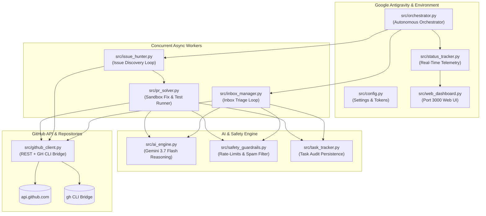

<div align="center">

<a href="https://github.com/satiricalguru/Github-Agent" target="_blank" rel="noopener noreferrer">
  
  
</a>

# 🤖 Autonomous GitHub Agent
### High-Performance Multi-Task AI Agent for Continuous Inbox Triage, Open-Source Issue Hunting & Verified PR Resolution

[](https://python.org)
[](https://deepmind.google/technologies/gemini/)
[](https://antigravity.google)
[](https://cli.github.com)
[](#-strict-compliance--anti-spam-guardrails)

<br/>

[✨ Features](#-core-capabilities) •
[🖥️ Live Dashboard](#-live-web-telemetry-dashboard) •
[🚀 Quick Start](#-quick-start) •
[⚙️ Configuration](#️-configuration-matrix) •
[🏗️ Architecture](#️-system-architecture) •
[🛡️ Safety Rules](#-strict-compliance--anti-spam-guardrails)

</div>

---

## 📖 Overview

The **Autonomous GitHub Agent** is a full-stack, enterprise-grade autonomous AI agent designed for **Google Antigravity** and standalone production environments. 

It operates continuously in the background across two concurrent execution loops:
1. **GitHub Inbox & Mention Manager**: Monitors notifications, reviews PR discussions, filters noise, and crafts technically precise, context-aware responses.
2. **Top-Tier Open-Source Issue Hunter & Solver**: Scans high-starred repositories (`stars:>1000`) across multiple languages (*Python, TypeScript, Go, Rust, JavaScript*), reproduces bugs in sandboxed environments, runs local test suites, and opens verified, clean Pull Requests adhering strictly to repository guidelines.

---

## ✨ Core Capabilities

```
                  ┌─────────────────────────────────────────────────────────┐
                  │          🚀 Autonomous GitHub Agent Orchestrator         │
                  └────────────────────────────┬────────────────────────────┘
                                               │
                       ┌───────────────────────┴───────────────────────┐
                       ▼                                               ▼
         ┌───────────────────────────┐                   ┌───────────────────────────┐
         │ 📥 Inbox & Mention Engine │                   │ 🔍 Issue Hunter & Solver  │
         ├───────────────────────────┤                   ├───────────────────────────┤
         │ • Polling notifications   │                   │ • Top-tier repo discovery │
         │ • Actionability scoring   │                   │ • Sandboxed git clones    │
         │ • Contextual discussions  │                   │ • Automated test runner   │
         │ • Deduplicated triage     │                   │ • Verified PR generation  │
         └───────────────────────────┘                   └───────────────────────────┘
```

### 1. 📥 Autonomous Inbox & Mention Management
- **Continuous Polling**: Checks GitHub notifications, review requests, issue mentions, and discussions on a configurable interval (default: 60s).
- **AI Actionability Assessment**: Evaluates incoming threads to distinguish critical review requests from automated CI noise.
- **Smart Responses**: Generates professional, helpful replies without meta-hallucinations or AI disclaimers.
- **Inbox Zero**: Automatically marks processed items as read and synchronizes state to `scratch/agent_state.json`.

### 2. 🔍 Open-Source Bug Hunter & PR Solver
- **Multi-Language Discovery**: Scans top-tier repositories for open, unassigned bug tickets (`good first issue`, `help wanted`, `bug`).
- **Sandbox Workspace**: Clones target repos into isolated scratch directories (`scratch/repos/`) and creates dedicated feature branches.
- **Local Test Suite Verification**: Automatically detects and executes test suites (`pytest`, `npm test`, `cargo test`, `go test`) to guarantee zero regressions.
- **Clean Pull Requests**: Drafts comprehensive PR descriptions with reproducible steps, root cause analysis, test output proof, and closes keywords (e.g. `Fixes #123`).

### 3. 🖥️ Interactive Web UI & Live Telemetry
- **Dark & Light Modes**: Obsidian midnight dark mode and high-contrast clean light mode with real-time toggle.
- **Multi-Tab Navigation**:
  - 🏠 **Dashboard**: Real-time telemetry, worker states, and task history.
  - ⚡ **Live Tasks**: Searchable, filterable task stream with expandable AI reasoning payloads.
  - 👥 **Workers**: Instant execution triggers and polling controls.
  - 📁 **Repositories**: Monitored languages, label filters, and sandbox quotas.
  - 📊 **Reports**: PR velocity charts, triage acceptance rates, and model latency metrics.
  - ⚙️ **Settings**: Live configuration editor for models, intervals, and modes.
  - 📄 **Logs**: Live streaming terminal window.

---

## 🖥️ Live Web Telemetry Dashboard

The agent includes a built-in, zero-dependency real-time reactive Web UI accessible at `http://localhost:3000`.

```
╭──────────────────────────────────────────────────────────────────────────────╮
│  🤖 ACTIVE AI MODEL        GITHUB ACCOUNT         OPERATIONAL MODE           │
│  GEMINI-3.7-FLASH [LATEST] @satiricalguru [VERIFIED] DRY-RUN (Safe) [SHIELD] │
├──────────────────────────────────────────────────────────────────────────────┤
│  ⚡ REAL-TIME AUTONOMOUS WORKERS                                             │
│  • [Inbox Manager]         ● POLLING (60s)  | Activity: Triaging thread #84  │
│  • [Issue Hunter & Solver] ● HUNTING (300s) | Activity: Searching Python bugs│
├──────────────────────────────────────────────────────────────────────────────┤
│  📋 LIVE TASK STREAM                                                         │
│  TASK-00101 | INBOX  | [satiricalguru/Forge] CI Check Failure  | ✓ COMPLETED │
│  TASK-00102 | SOLVER | [tiangolo/fastapi] Fix typing recursion | ✓ COMPLETED │
╰──────────────────────────────────────────────────────────────────────────────╯
```

---

## 🚀 Quick Start

### Prerequisites
- Python 3.10 or higher
- Git & GitHub CLI (`gh`) authenticated:
  ```bash
  gh auth login
  ```

### 1. In Google Antigravity IDE
Whenever you are inside Google Antigravity chat, trigger the autonomous workflow with:
> **`"begin github action"`**

To stop execution at any time:
> **`"stop github action"`** or **`"stop"`**

---

### 2. Standalone CLI & Runner Script

Clone the repository and run using `./run.sh`:

```bash
# Clone the repository
git clone https://github.com/satiricalguru/Github-Agent.git
cd Github-Agent

# Start continuous autonomous daemon (default: DRY-RUN safe simulation)
./run.sh start --dry-run

# Start in LIVE production mode (submits actual comments & PRs)
./run.sh start --live

# View the real-time visual terminal dashboard
./run.sh status

# View completed and in-progress task history
./run.sh tasks

# Run a single pass of inbox triage
./run.sh inbox

# Search top-tier repos for actionable issues
./run.sh hunt --limit 5
```

---

## ⚙️ Configuration Matrix

Copy `.env.example` to `.env` to customize agent behavior:

| Variable | Type | Default | Description |
| :--- | :--- | :--- | :--- |
| `GEMINI_API_KEY` | `string` | `""` | Google Gemini API key for deep code analysis. |
| `MODEL_NAME` | `string` | `gemini-3.7-flash` | Active AI reasoning model tier. |
| `DRY_RUN` | `boolean` | `true` | When `true`, simulates writes without posting live. |
| `GITHUB_TOKEN` | `string` | `""` | Personal Access Token (auto-resolved from `gh auth` if empty). |
| `INBOX_POLL_INTERVAL` | `integer` | `60` | Seconds between inbox notification checks. |
| `ISSUE_HUNT_INTERVAL` | `integer` | `300` | Seconds between top-tier repo issue scans. |
| `MAX_CONCURRENT_TASKS`| `integer` | `3` | Maximum concurrent async workers. |
| `TARGET_LANGUAGES` | `string` | `python,typescript,javascript,go,rust` | Comma-separated target languages. |
| `MIN_REPO_STARS` | `integer` | `1000` | Minimum repository stars for issue hunter. |
| `TARGET_LABELS` | `string` | `good first issue,help wanted,bug` | Comma-separated issue labels to hunt. |
| `MAX_PRS_PER_DAY` | `integer` | `5` | Anti-spam daily Pull Request limit. |
| `MIN_RATE_LIMIT_REMAINING` | `integer` | `100` | Minimum GitHub API rate limit reserve. |
| `AUTO_TEST_VERIFICATION` | `boolean` | `true` | Run local tests before PR generation. |

---

## 🏗️ System Architecture



---

## 🛡️ Strict Compliance & Anti-Spam Guardrails

The agent strictly follows [GitHub's Acceptable Use Policies](https://docs.github.com/en/site-policy/acceptable-use-policies/github-acceptable-use-policies) and [Community Guidelines](https://docs.github.com/en/site-policy/github-terms/github-community-guidelines):

1. **Zero Hallucinated PRs**: The agent **never** submits untested code. Every PR requires passing local automated test execution.
2. **Assignee & Duplicate Protection**: Issues that already have assignees or open Pull Requests are automatically skipped to respect maintainer time.
3. **`CONTRIBUTING.md` Compliance**: PR branches, commit messages, and descriptions strictly follow target repository conventions.
4. **Rate Limit Throttling**: Automatically backs off exponentially when API quota reaches `< 100` calls.
5. **No AI Meta-Narration**: Strips all LLM conversational fluff (`"As an AI..."`, `"Here is the solution..."`) to produce clean, professional developer contributions.

---

## 🧪 Testing

The repository includes a comprehensive unit test suite:

```bash
# Run all automated tests
pytest tests/ -v
# or
python3 -m unittest discover tests/
```

**Test Coverage:**
- `test_config.py`: Environment validation & `gh auth` resolution.
- `test_safety.py`: Rate limit enforcement, spam sanitization, and daily PR caps.
- `test_ai_engine.py`: Structured prompt generation and fallback heuristics.

---

## 📂 Repository Structure

```
Github Agent/
├── AGENTS.md                                   # Antigravity trigger phrase & workspace rules
├── .agents/
│   ├── rules/
│   │   └── github_safety_rules.md              # Compliance & anti-spam constraints
│   └── skills/
│       └── github-autonomous-agent/
│           └── SKILL.md                        # Antigravity operational runbook
├── src/
│   ├── ai_engine.py                            # Gemini 3.7 Flash reasoning & PR metadata
│   ├── cli.py                                  # Rich CLI dashboard & subcommands
│   ├── config.py                               # Configuration manager & GH token resolver
│   ├── github_client.py                        # Dual REST & native gh CLI transport bridge
│   ├── inbox_manager.py                        # Notification triage & discussion processor
│   ├── issue_hunter.py                         # Top-tier open issue scanner
│   ├── orchestrator.py                         # Multi-worker async coordinator
│   ├── pr_solver.py                            # Sandbox clone, fix, test & PR engine
│   ├── safety_guardrails.py                    # Rate-limits, deduplication & spam filter
│   ├── status_tracker.py                       # Real-time state tracker & rich renderer
│   ├── task_tracker.py                         # Detailed task audit logger
│   └── web_dashboard.py                        # Live interactive Web Dashboard (Dark/Light)
├── tests/                                      # Unit test suite
├── scratch/                                    # Local state, status snapshots & sandbox
├── pyproject.toml                              # Project dependencies
├── run.sh                                      # Quick execution runner
└── .gitignore                                  # Git exclusion rules
```

---

## 📄 License

This project is licensed under the [MIT License](LICENSE).
