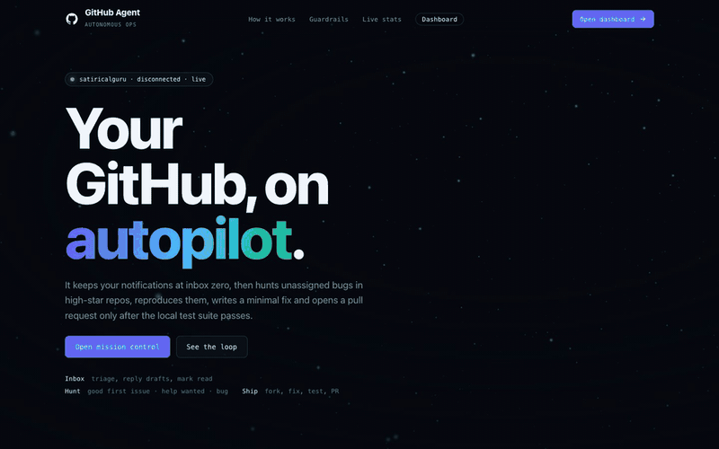
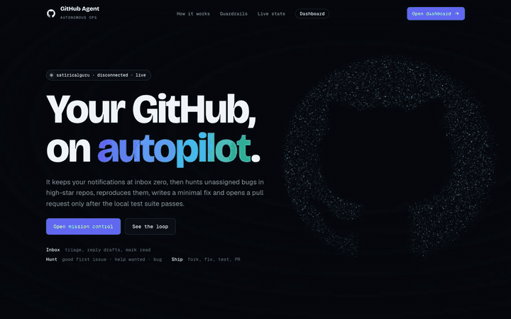
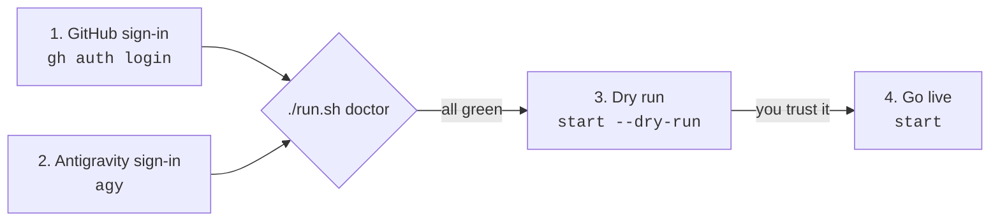
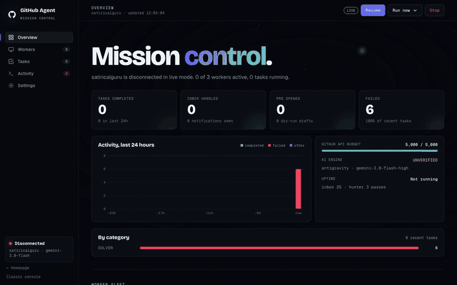
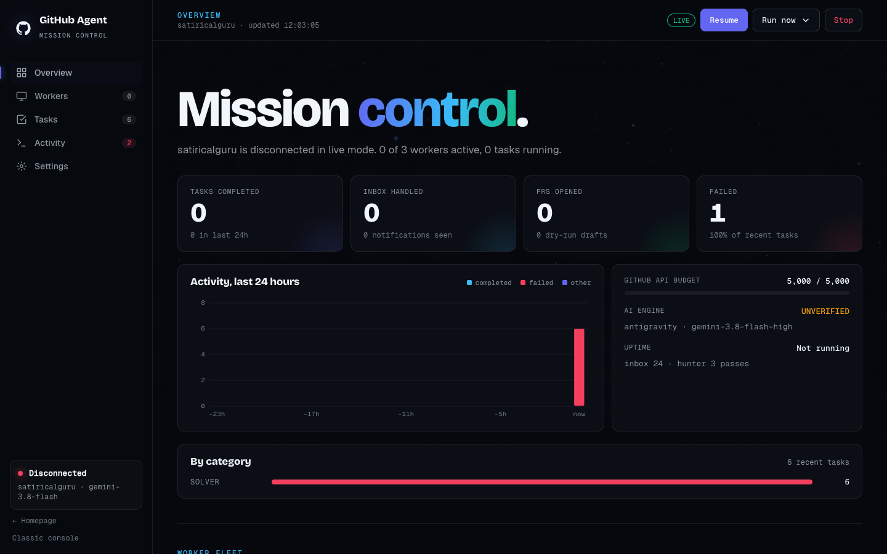
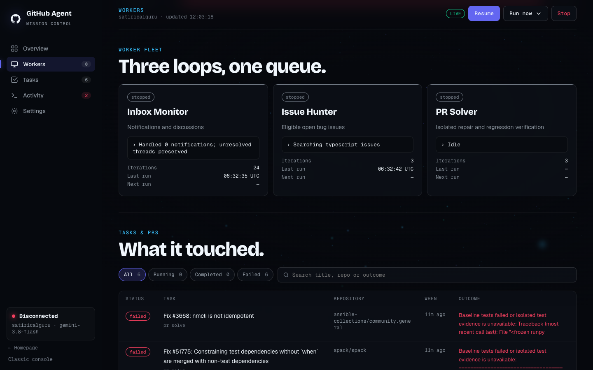
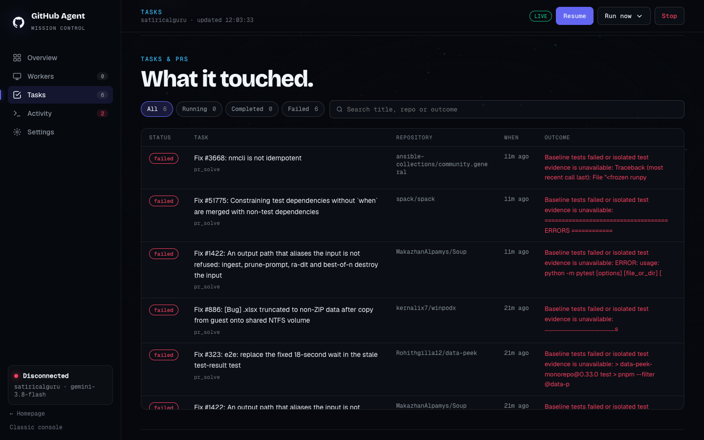
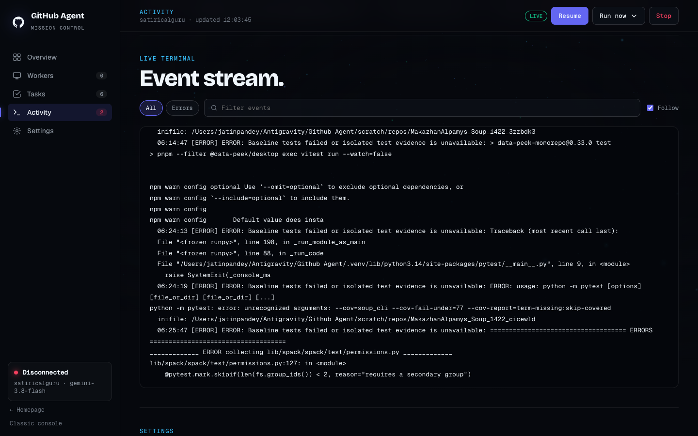
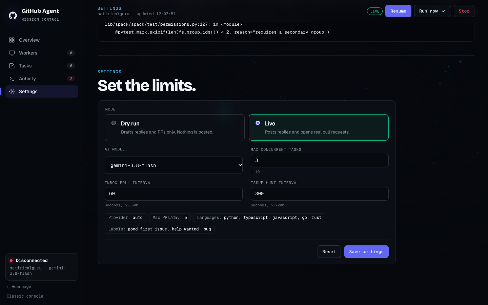
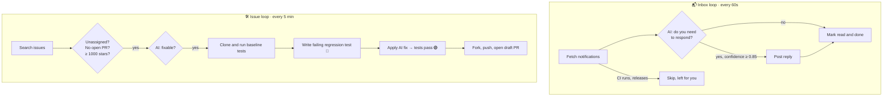

<div align="center">


# GitHub Autonomous Agent

**Your GitHub, on autopilot.**<br>
Keeps your notifications at inbox zero, hunts open-source bugs, and opens a pull request only after the tests pass.

[](https://github.com/satiricalguru/Github-Autonomous-Agent/actions/workflows/ci.yml)




[Quick start](#-quick-start) · [Connect your account](#-connect-your-own-account) · [Dashboard](#-mission-control-dashboard) · [How it works](#-how-it-works) · [Safety](#-guardrails) · [FAQ](#-faq)

</div>

---

## ✨ What it does

<table>
<tr>
<td width="33%" valign="top">

### 📬 Triage
Reads your review requests, mentions and discussions. An AI model decides whether you're needed, with a confidence score and its reasoning. Then it replies or marks the thread done.

</td>
<td width="33%" valign="top">

### 🔎 Hunt
Searches high-star repos for open, unassigned `good first issue`, `help wanted` and `bug` issues. It skips anything already assigned or with an open PR.

</td>
<td width="33%" valign="top">

### 🛠️ Ship
Clones the repo and proves the bug with a failing test before fixing it. When the suite goes green, it opens a **draft** PR with the test output attached.

</td>
</tr>
</table>

<div align="center">

<br><sub>The homepage's WebGL particle field changes shape as you scroll. <a href="docs/media/home-scroll.mp4">Watch the HD video</a>.</sub>
</div>

---

## 🚀 Quick start

> [!NOTE]
> You need **Python 3.10+**, **Git**, the **GitHub CLI** (`gh`), and the **Antigravity CLI** (`agy`). It runs on macOS (built-in sandbox) or Linux (Docker).

```bash
git clone https://github.com/satiricalguru/Github-Autonomous-Agent.git
cd Github-Autonomous-Agent
python3 -m venv .venv
.venv/bin/python -m pip install -c requirements.lock -e '.[dev]'
cp .env.example .env
```

Then [connect your account](#-connect-your-own-account) and start it:

```bash
./run.sh doctor          # checks GitHub, the AI model and the test sandbox
./run.sh start --dry-run # try it first: drafts only, nothing is posted
```

Open **http://127.0.0.1:3000** for the homepage, or **http://127.0.0.1:3000/dashboard** for mission control.

---

## 🔐 Connect your own account

The agent acts **as you**: replies, forks and PRs come from your GitHub account. It needs two separate sign-ins, one for GitHub and one for the AI models.



### Step 1: GitHub

**Option A: GitHub CLI (recommended).** Nothing to paste, and the agent finds the token on its own.

```bash
gh auth login        # choose GitHub.com → HTTPS → log in with a web browser
gh auth status       # should say: Logged in to github.com account <you>
```

**Option B: a personal access token.** Use this for servers or when you don't want `gh`.

1. Go to **GitHub → Settings → Developer settings → [Personal access tokens](https://github.com/settings/tokens)**.
2. Create a token with these scopes: `repo` (fork, push, open PRs), `notifications` (read your inbox), `read:discussion` and `write:discussion` (discussion replies), and `workflow` (only if target repos change workflow files).
3. Put it in `.env`:

```dotenv
GITHUB_TOKEN=ghp_your_token_here
GITHUB_USERNAME=your-github-username
```

> [!IMPORTANT]
> `.env` holds your token. It's already in `.gitignore`. Never commit it or paste it anywhere public.

### Step 2: AI models (Google Antigravity)

The agent calls models through your Antigravity account, so you don't need an API key.

1. Install the **Antigravity CLI** (`agy`) that ships with Google Antigravity, and make sure `agy` is on your `PATH`.
2. Run `agy` once in a terminal and complete the sign-in it asks for.
3. Confirm it works:

```bash
agy models   # lists the models your account can use
```

Pick a model in `.env`. The default is fast and reliable:

```dotenv
AI_PROVIDER=antigravity
MODEL_NAME=gemini-3.8-flash-high
```

<details>
<summary><b>Prefer a direct API key instead?</b> (Gemini, Anthropic or any OpenAI-compatible endpoint)</summary>

```dotenv
AI_PROVIDER=gemini        # or anthropic, openai
MODEL_NAME=gemini-3.8-flash
GEMINI_API_KEY=...        # or ANTHROPIC_API_KEY / OPENAI_API_KEY (+ OPENAI_BASE_URL)
```

</details>

### Step 3: Check everything

```bash
./run.sh doctor
```

`doctor` makes one real model call, checks your GitHub login and API quota, and runs a throwaway sandboxed test. It never touches your inbox or opens a PR.

### Step 4: Dry run, then go live

```bash
./run.sh start --dry-run   # reads GitHub and drafts everything; posts nothing
./run.sh start             # LIVE: replies, marks threads done, opens draft PRs
```

> [!WARNING]
> **`start` runs in live mode by default** and clears the previous run's task history. Use `--dry-run` until you're happy with what it drafts, and `--keep-history` to keep old tasks. The agent always remembers which threads and issues it already handled, so it never replies to the same one twice.

---

## 🛰️ Mission control dashboard

<div align="center">

</div>

| | |
|---|---|
| **Overview**: live counters, a 24-hour activity chart, GitHub API budget, AI engine health. <br> | **Workers**: what the inbox monitor, issue hunter and PR solver are doing right now. <br> |
| **Tasks**: filter, search, and click any row for the AI's reasoning, diff and test output. <br> | **Activity**: the live event stream, with error filtering and search. <br> |

From the top bar you can **Pause/Resume**, trigger a pass with **Run now** (inbox, hunt or solve), or **Stop**. The **Settings** section switches between live and dry run, changes the model, and tunes concurrency and polling intervals.



---

## ⚙️ How it works



Every PR has to clear all of these gates, or it never gets opened:

1. The repo's existing tests pass before any change.
2. A **new** regression test fails on the current code, proving the bug.
3. The fix makes that test pass and keeps every existing test green.
4. The exact commit is re-verified, with no stray changes.
5. The PR is opened as a **draft**, with full test evidence in the description.

---

## 🛡️ Guardrails

| Guardrail | What it means |
|---|---|
| 🧪 **Tests or nothing** | A red suite blocks the commit. Untested code never leaves the sandbox. |
| 🧱 **Sandboxed tests** | Test runs have no network and can't touch your home folder or credentials (macOS `sandbox-exec` or Docker). |
| 🚦 **Rate-limit aware** | It backs off before your GitHub API quota runs low. |
| 🧾 **Daily PR cap** | At most `MAX_PRS_PER_DAY` (default 5) live PRs per rolling 24 hours. |
| 🤝 **Etiquette** | Follows `CONTRIBUTING.md` and PR templates, signs off commits (DCO), and skips CLA repos you haven't accepted. |
| 🎯 **Scope control** | `ALLOWED_REPOS`, `DENIED_REPOS`, `MIN_REPO_STARS`, `TARGET_LANGUAGES` and `TARGET_LABELS` in `.env`. |
| 🔒 **Local only** | The dashboard binds to `127.0.0.1`, and control actions need a session token. |

---

## 🤖 Models

Any model your Antigravity account lists in `agy models` works. These have been tested end to end:

| Model | Speed | Good for |
|---|---|---|
| `gemini-3.8-flash-high` ⭐ default | ~20s | Everything; best balance |
| `gemini-3.8-flash-low` | ~20s | High-volume inbox triage |
| `gemini-3.1-pro-high` | ~35s | Harder repairs |
| `claude-sonnet-4-6` | ~20s | Careful code patches |
| `claude-opus-4-6-thinking` | ~20s | The trickiest fixes |
| `gpt-oss-120b-medium` | slow | Fallback |

Up to two model calls run at once (`ANTIGRAVITY_MAX_PARALLEL`), and a failed call is retried once. You can switch models live from the dashboard's Settings.

---

## 🧰 Commands

```bash
./run.sh start [--dry-run] [--keep-history] [--port 3000]  # run continuously (live by default)
./run.sh stop                                              # stop a running agent
./run.sh doctor                                            # health check, no writes
./run.sh status                                            # worker states in the terminal
./run.sh tasks                                             # recent task table
./run.sh inbox [--live]                                    # one inbox pass (dry run unless --live)
./run.sh hunt --limit 5                                    # find candidate issues only
./run.sh solve --auto --limit 1 [--live]                   # find and fix one issue
./run.sh web --port 3001                                   # dashboard only, no agent
```

Pages: `/` homepage · `/dashboard` mission control · `/classic` the original console.

<details>
<summary><b>All <code>.env</code> settings</b></summary>

| Variable | Default | Purpose |
|---|---|---|
| `GITHUB_TOKEN` / `GITHUB_USERNAME` | from `gh` | Your GitHub identity |
| `AI_PROVIDER` | `antigravity` | `antigravity`, `gemini`, `anthropic`, `openai` or `auto` |
| `MODEL_NAME` | `gemini-3.8-flash-high` | Model ID |
| `ANTIGRAVITY_MAX_PARALLEL` | `2` | Concurrent Antigravity calls |
| `INBOX_POLL_INTERVAL` | `60` | Seconds between inbox passes |
| `ISSUE_HUNT_INTERVAL` | `300` | Seconds between issue hunts |
| `MAX_CONCURRENT_TASKS` | `3` | Parallel repairs |
| `MAX_PRS_PER_DAY` | `5` | Rolling 24h live PR cap |
| `TARGET_LANGUAGES` | `python,typescript,javascript,go,rust` | Languages to hunt |
| `TARGET_LABELS` | `good first issue,help wanted,bug` | Labels to hunt |
| `MIN_REPO_STARS` | `1000` | Minimum repo popularity |
| `ALLOWED_REPOS` / `DENIED_REPOS` | empty | Restrict or exclude repos |
| `ENGAGE_DISCUSSIONS` | `true` | Allow replies on Discussions |
| `SANDBOX_IMAGE` | empty | Docker image with test dependencies (needed on Linux) |
| `ACCEPTED_CLA_REPOS` | empty | Repos whose CLA you've signed |

</details>

---

## ❓ FAQ

<details>
<summary><b>Will it spam people with PRs?</b></summary>

No. PRs are drafts, capped per day, opened only after a failing test proves the bug and the fix turns it green. It never takes an issue that's assigned or already has a linked PR.

</details>

<details>
<summary><b>Why haven't I seen any PRs yet?</b></summary>

Most real projects need their own dependencies installed before their tests can run. The sandbox has no network, so it can't install them. On macOS, only repos whose tests run with plain `pytest` will pass the baseline today. For broad coverage, build a Docker image with common toolchains and set `SANDBOX_IMAGE`.

</details>

<details>
<summary><b>Can I use it without Antigravity?</b></summary>

Yes. Set `AI_PROVIDER` to `gemini`, `anthropic` or `openai` and add that provider's API key.

</details>

<details>
<summary><b>Does it keep running when I close the terminal?</b></summary>

No. It runs while the process is alive. Use `tmux`, `screen`, or a launchd/systemd service if you want it always on.

</details>

<details>
<summary><b>Where is my data stored?</b></summary>

Everything stays local in `scratch/`: task history, handled threads, settings and the control token. Nothing is sent anywhere except GitHub and your AI provider.

</details>

---

## 🧑‍💻 Development

```bash
cd frontend && npm ci && npm run build && cd ..   # build and sync dashboard assets
.venv/bin/python -m pytest -q                     # test suite
node scripts/capture_readme_media.mjs http://127.0.0.1:3000 docs/media && scripts/build_readme_media.sh   # refresh README media
```

Technical deep dives: [audit findings](docs/audits/2026-09-16/AUDIT.md) and [repair evidence](docs/audits/2026-09-16/REPAIRS.md).

<div align="center">
<br>

<br>
<sub>MIT © <a href="https://github.com/satiricalguru">Jatin Pandey</a> · Not affiliated with GitHub, Inc. or Google.</sub>
</div>
